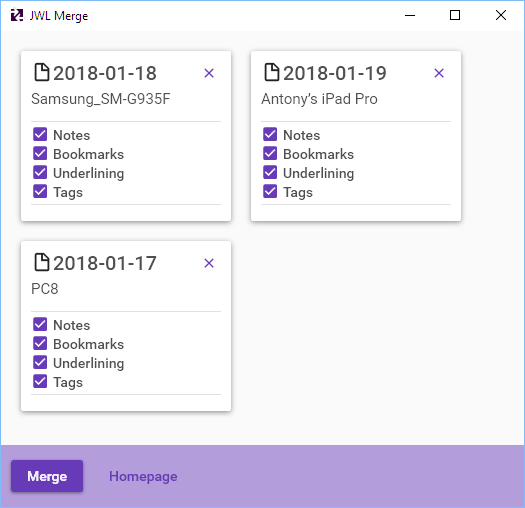

# JWLMerge 

### Introduction

JWLMerge is a utility to merge 2 or more .jwlibrary backup files. These backup files are created using the JW Library® backup command, and contain your personal notes, highlighting, etc.

At time of writing, JW Library has _backup_ and _restore_ commands, but no _merge_ command. This means you can add personal annotations in JW Library on several devices and transfer these between devices, but cannot combine them into a single set. JWLMerge is a Windows application that allows you to merge 2 or more .jwlibrary files into a single backup file that can then be restored onto any device.

### Usage

Download the JWLMergeSetup.exe file from the latest release and run it.

https://github.com/AntonyCorbett/JWLMerge/releases/latest

Please see the wiki for further information.

#### Wine

If you are interested in running JWLMerge on Wine, please see this fork:

https://github.com/SuperJC710e/JWLMerge

And the notes here: 

https://github.com/SuperJC710e/JWLMerge/wiki/Running-Under-Wine

### Important Notes

Please use at your own risk! It is possible to crash JW Library by attempting to restore a corrupt backup file, and sometimes the only solution is to reinstall JW Library and reset its data. (This hasn't happened yet with a JWLMerge-generated file.)

The format of your data in the backup files may change with future JW Library releases and I will try to keep the code up-to-date. If you receive an error stating that the backup file version is not supported then please come back here to see if an update is available.

It is possible that JW Library will eventually feature a _merge_ command or similar functionality, in which case this project will be archived.

Please review the JW Library terms and conditions of use. Some view the backup data files as their _own_ data and not subject to the conditions; others feel differently. Please make your own decision on this matter.

There is no guarantee of software support. However, if you find a bug or other problem, please feel free to create an issue in this project.

Log files are stored in your Documents\JWLMerge\Logs folder.

"JW Library" is a registered trademark of Watch Tower Bible and Tract Society of Pennsylvania.
